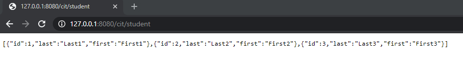
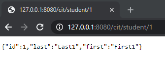
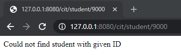
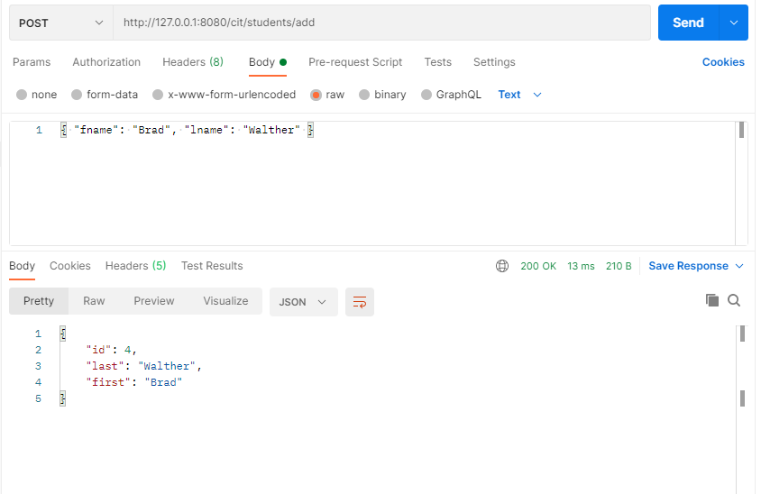

# Welcome to the Cit 281 Lab 5 Page

### What I learned:

- Installing and Downloading a software called "Postman."
- Using Postman to respond to fastify servers with GET.
- Having Postman respond to fastify servers with JSON.
- Introduction to POST requests.

### Purpose of Lab:

- This lab assisted us with installing Postman and setting up Postman for Cit 281.
- We created a fastify web server that responded with different outputs from an array, depending on the route entered in the url of the browser.
- Lastly, we were able to have Postman send a request to the server as a POST request and have the server respond to Postman.

### Outcome pics:

### [**Back to home page**](https://uo-cit-itsbread33.github.io/ItsBread33.github.io/)
